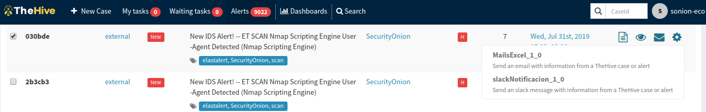
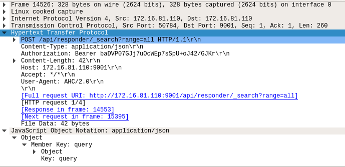
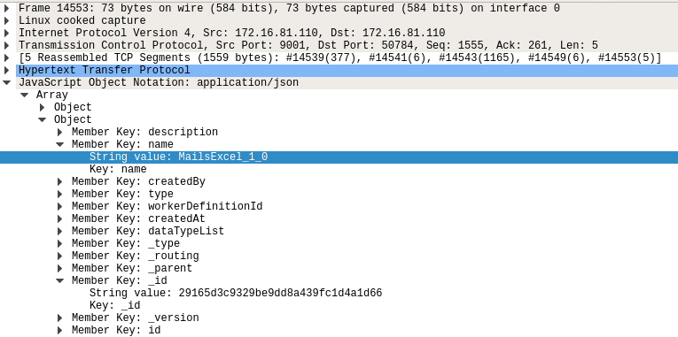

# Obtener ID de un responder a traves de su nombre

## Analisis de mensajes intercambiados

Se detalla como TheHive obtiene el ID de un Responder de Cortex en base al 
nombre del Responder.

Para ello se analiza los paquetes en Wireshark.

Para comenzar sniffeamos el trafico usando Wireshark en el servidor que
contiene TheHive, filtrando el puerto 9001 correspondiente a Cortex.

En la interfaz de TheHive activamos algun Responder (en este caso la alerta cuenta
con todos los observables que requiere el Responder).

Luego se analiza el intercambio de mensajes entre TheHive y Cortex en Wireshark.

The Hive envia una solicitud POST: /api/responder/_search?range=all 

Cortex respode la solicitud enviando un JSON. Este JSON contiene un object para
cada Responder, de esta podemos analizar los campos Name hasta que coincida con
el nombre del Responder para luego obtener el valor del campo ID.

